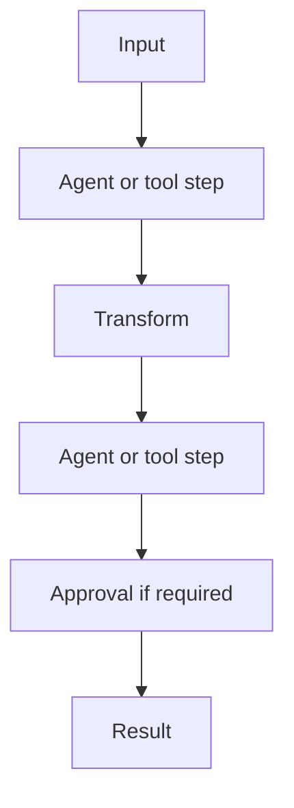

# Flows

A Flow is a versioned, durable process with explicit steps. Use an agent when the model should choose the next action; use a Flow when your application owns the control path.

| | Agent | Flow |
|---|---|---|
| Control flow | Model-led | Definition-led |
| Multiple steps | Tool loop | Explicit steps and branches |
| Durability | One run | Versioned execution and checkpoints |
| Human approval | Tool gate | Tool gate or checkpoint |
| Best for | Open-ended work | Repeatable business processes |

For example: lead arrives → research company → analyze lead → generate outreach → human approval → send. State is stored as data, so later steps can consume prior output and a worker can resume after a pause. Supported step kinds include agent, tool, branch, wait, checkpoint, subflow, and done; failure policy can retry, skip, escalate, or fail.

Next: [First Flow](../getting-started/first-flow), [Agents](../concepts/agents), [HITL](../concepts/human-in-the-loop), [Durable runtime](../concepts/durable-runtime), [Flow API](/api/), and the [flow specification](/specifications/durable-runtime-and-hitl).
