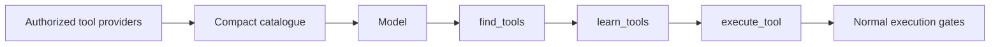

# Tool discovery & production safety

Most first agents need only a few preloaded tools. This guide is for applications with many tools, tenant-specific capability sets, or higher-risk actions.

## Keep the catalogue small

Tools reach the model through a compact, permission-filtered catalogue. Preload the tools an agent uses often and let it discover the rest when needed. `catalogBudget` caps the tool-description tokens placed in context; a `catalog.truncated` event records anything left out.

Use `createToolSearch()` to make `find_tools` available. It searches only the tools the caller is authorized to use. A model can then load a tool schema with `learn_tools` and call a discovered tool through `execute_tool`; the normal authorization, approval, validation, and idempotency path still applies.

## Tenant toolsets

Authorization answers “may this caller use this tool?” A toolset answers “does this tenant enable this category at all?” Toolsets apply before authorization, so disabled categories are absent from discovery, search, and execution.

## External and destructive effects

`external-write` and `destructive` tools require approval and idempotency. If the approval gate or idempotency store is not wired, Forge refuses the action instead of performing an unprotected side effect. Treat that refusal as a configuration error.

For shadow runs, external and destructive actions are suppressed and recorded rather than executed. Internal writes are not automatically suppressed; only use shadow mode when that distinction is acceptable for your workflow.

## Shell execution

`shell_exec` is destructive. It requires both a sandbox and an explicit shell capability declaration. The standard library does not silently fall back to running commands on the host; a local sandbox requires an explicit unsafe opt-in in application code.

## Large results

Tool results use a shared success/error envelope. With blob storage wired, oversized successful results can be spilled to authorized storage and read later with `read_tool_output`, keeping model context bounded.

## Next

- Start with the basic tool contract → **[Tools](../concepts/tools)**
- Configure supplied tools → **[Built-in tools](../guides/tools)**
- Add human review to writes → **[Human-in-the-Loop](../concepts/human-in-the-loop)**
- Read the design rationale → **[Tool catalogue specification](/specifications/tool-catalogue)**
