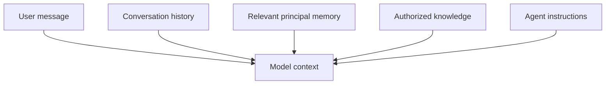

# Memory

Memory is information Forge can retrieve for a principal beyond the current conversation. It is distinct from conversation history and from document retrieval.



## Context vs memory vs knowledge

| Concept | Lifetime | Source | Use it for |
|---|---|---|---|
| Context | One run | Instructions, history, and providers | The information a model sees now |
| Memory | Across conversations | Principal-memory store | Durable user facts and preferences |
| Knowledge | Retrieved per query | Authorized documents and indexes | Grounding an answer in source material |

## Why memory exists

Conversation history only follows one conversation. Principal memory lets an application retain relevant facts for one tenant and principal—for example a writing preference—without copying them into every request.

## Minimal setup

`createPrincipalMemoryProvider` is a context provider. Wire it with a `PrincipalMemoryStore`; the in-memory store is suitable for a demo, while PostgreSQL/Supabase-backed stores are required for persistence across processes.

```ts
import { createPrincipalMemoryProvider } from "@retinue/agentkit/context";
import { createMemoryPrincipalMemoryStore } from "@retinue/agentkit/persistence";

const store = createMemoryPrincipalMemoryStore();
const memory = createPrincipalMemoryProvider({ store, maxEntries: 8 });
```

Memory is scoped by tenant and principal. A different tenant or principal cannot retrieve another person's entries through the store contract. In production, run the provider with the same persistent store used by the API and workers.

Next: [Sessions and threads](sessions), [Knowledge and retrieval](retrieval), [Memory API](/api/), and the [memory specification](/specifications/user-memory).

## What is it?

Memory is what the agent knows beyond the current message. Forge layers it by **scope and
lifetime**, and assembles the relevant pieces into each prompt **under the model's token budget**.

| Scope | Keyed by | Lifetime |
|---|---|---|
| **Session** | conversation | one thread |
| **User** | tenant + principal | across the user's threads |
| **Tenant** | tenant | org-wide (knowledge + instructions) |

## Why would I use it?

So the assistant remembers what matters — the current thread, facts about the user, and org
knowledge — **without** blowing the context window. The naive "re-send the last N turns" approach
bloats prompts and fails on long threads; Forge budgets and compacts instead.

## Session memory

Durable working memory for a thread: a bounded, versioned document written by the runtime and
tools (never raw model output), read at the start of each turn, committed atomically with the
turn. See **[Sessions & threads](sessions)**.

## User memory

Cross-session, per-principal memory — the "remembers you" layer. Facts are **extracted and
deduped before commit**, retrieved as a budgeted context section ranked *below* recent turns,
and fully user-controllable (list / edit / delete / disable). Strictly tenant + principal
isolated.

```ts
// user memory enters a run as a context provider, not a raw dump
"User prefers a formal tone"        // source: user-stated
"Works in the EU (data residency)"  // source: extracted, deduped
```

## Tenant memory

Org-wide knowledge via **[retrieval / RAG](retrieval)** (permission-scoped, cited) plus standing
"tenant instructions" (brand voice, rules).

## The budget

Each turn, Forge computes a budget from the **selected model's** context limit, fills it by
priority (base policy, session state, recent turns, tool continuity are protected), prunes old
reasoning/tool detail first, **compacts** older history into a summary rather than dropping it,
and **fails loudly** if critical instructions can't fit — never silent truncation.

Next: **[Sessions & threads](sessions)**.

## Where this is specified

This page is the shape of the thing. The specification is where the decisions and their reasons live — read it
when you need to know *why* something behaves the way it does, or what was considered and rejected.

- [User memory](/specifications/user-memory)
- [Knowledge and documents](/specifications/knowledge-and-documents)
