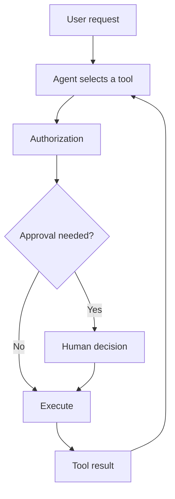

# Tools

A tool is a typed capability an agent can call to read data or take an action beyond the model.

## Why tools exist

Models can explain what to do, but they cannot safely inspect your inventory, query an internal service, or send a message. A Retinue tool is the boundary around that operation: it describes the inputs the model may supply and classifies the action before it executes.



## Your first custom tool

Use `defineTool` for an operation that reads data. Give it a descriptive name, a useful model-facing description, and an input schema. Schemas are optional in the public helper, but strongly recommended: without one, the model has no reliable argument contract.

```ts
import { createAgent } from "@retinue/agentkit/providers";
import { defineTool } from "@retinue/agentkit/tools";

const inventory = new Map([["SKU-1", { name: "Blue mug", inStock: 14 }]]);

const checkStock = defineTool({
  name: "check_stock",
  label: "Check stock",
  description: "Look up stock by SKU.",
  category: "inventory",
  effect: "read",
  inputSchema: {
    type: "object",
    properties: { sku: { type: "string" } },
    required: ["sku"],
  },
  execute: async (input: { sku: string }) => inventory.get(input.sku) ?? { error: "Unknown SKU" },
});

const agent = createAgent({
  manifest: {
    id: "stock-agent",
    name: "Stock agent",
    instructions: "Use the inventory tool before answering stock questions.",
    modelPolicy: { role: "smart" },
  },
  tools: [{ id: "inventory", listTools: async () => [checkStock] }],
});
```

`ToolProvider` is the interface between an agent and one or more tools. The inline provider above is appropriate for a fixed example; use `toolProvider("inventory", [checkStock])` for a fixed set, or implement `listTools(context)` when available tools depend on the tenant or caller.

This example is compile-checked in [`website/examples/agent-with-tool.ts`](https://github.com/Rise-Experts/retinue/blob/main/website/examples/agent-with-tool.ts).

## Effects, approval, and idempotency

An effect states what the tool can change. Retinue uses it to apply safety rules before the tool function runs.

| Effect | Meaning | Default approval behavior |
|---|---|---|
| `read` | Returns data without changing state | `never` |
| `internal-write` | Changes data owned by this deployment | `never`; a tool may explicitly request `policy` |
| `external-write` | Sends, publishes, or changes an external system | `always` |
| `destructive` | Deletes or irreversibly changes data | `always` |

For an external write, use `confirms()`. It fixes the effect to `external-write`, requires approval, and requires an idempotency key together. Use `destroys()` for an irreversible action.

```ts
import { confirms } from "@retinue/agentkit/tools";

const sendMessage = confirms({
  name: "send_message",
  description: "Send an approved message to a customer.",
  inputSchema: { type: "object", properties: { recipient: { type: "string" }, text: { type: "string" } }, required: ["recipient", "text"] },
  execute: async ({ recipient, text }: { recipient: string; text: string }) => ({ queuedFor: recipient, text }),
});
```

In embedded mode, an unapproved action returns an approval-required result. In server mode, the run can pause durably until a person approves or denies the stored action. See [Human-in-the-Loop](human-in-the-loop) for the decision and resume lifecycle.

## What runs at execution time

In the normal agent runtime, tools are filtered before discovery and checked again when called. Tool input is validated before execution. External and destructive effects need idempotency protection, so a retry returns the original result rather than repeating the side effect.

Tools can also return a normal result envelope: `{ ok: true, data }` on success, or `{ ok: false, error }` when the operation cannot run. Throw from a `defineTool` callback when the underlying service fails; Retinue converts it to that safe error shape.

## Choose the right starting point

| Need | Start with |
|---|---|
| Wrap one function your application owns | `defineTool` and a `ToolProvider` |
| Make a write safe by default | `confirms()` or `destroys()` |
| Add maintained vendor capabilities | An [integration package](../integrations/overview) |
| Connect a tenant-owned external tool server | [MCP](../mcp/overview) |
| Use Retinue's supplied utilities | [Built-in tools](../guides/tools) |

## Next

- Build a read and an approval-gated action → **[Your first tool](../getting-started/first-tool)**
- Browse supplied utilities and their wiring → **[Built-in tools](../guides/tools)**
- Scale discovery safely for large tool sets → **[Tool discovery & production safety](../build/tool-discovery)**
- Understand approval decisions → **[Human-in-the-Loop](human-in-the-loop)**
- Exact types and helpers → **[Tools API reference](/api/)**
- Design rationale → **[Tool catalogue specification](/specifications/tool-catalogue)**
