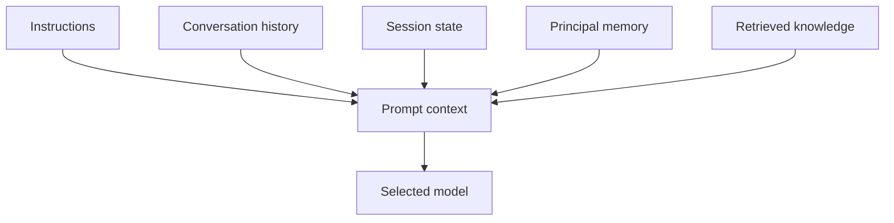

# Context

Context is the information Retinue assembles for an agent before a model call. It is not one unbounded prompt string.

Retinue keeps these sources distinct because they have different lifetimes and safety rules. Conversation history belongs to one conversation. Session state belongs to a thread. Principal memory can follow one person across conversations. Knowledge is retrieved from authorized documents for the current question.

Start with [Sessions and threads](../concepts/sessions), then [Memory](../concepts/memory), [Persistent memory](../guides/persistent-memory), and [Retrieval](../concepts/retrieval).
