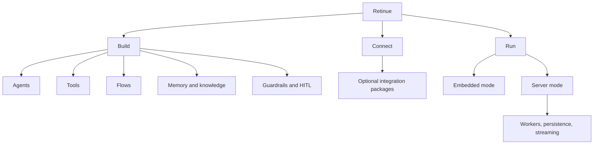

# Retinue mental model

Retinue is a TypeScript platform for building AI-powered programs that can safely use capabilities and keep working when the task outgrows a single model call.

## The pieces

| Piece | Plain-language meaning | Start here |
|---|---|---|
| **Agent** | A model-driven program with instructions and optional capabilities | [Agents](../concepts/agents) |
| **Tool** | A typed operation an agent may ask Retinue to perform | [Tools](../concepts/tools) |
| **Flow** | A repeatable process with explicit steps, pauses, and recovery | [Your first flow](first-flow) |
| **Conversation** | The messages exchanged with an agent | [Sessions and threads](../concepts/sessions) |
| **Memory** | Facts that can follow a principal across conversations | [Memory](../concepts/memory) |
| **Knowledge** | Indexed documents retrieved for a specific question | [Retrieval](../concepts/retrieval) |
| **Human-in-the-loop** | A durable question or approval that pauses a run | [Human-in-the-loop](../concepts/human-in-the-loop) |

## Two ways to run Retinue

**Embedded mode** is the shortest path: `createAgent().run()` uses in-memory reference adapters in one process. It is useful for a first agent, scripts, and tests. State does not survive a process restart.

**Server mode** uses the same contracts with PostgreSQL/Supabase, Redis/BullMQ, API hosting, and workers. Choose it for multi-user applications, live streaming, durable recovery, and cross-process execution.

Next: [build your first agent](quick-start).
