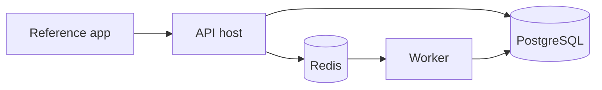

# Deployment

`compose.yaml` is a development/reference deployment: PostgreSQL, Redis, a one-time migration service, reference app, API host, and worker.

For production, run database backups, use managed secrets, deploy API and worker separately, set health probes, configure TLS/proxy behavior for streaming, and monitor queue depth and database readiness. Do not treat the reference application's development authentication as production authentication.

Next: [PostgreSQL](postgres), [Workers](workers), and [Configuration](../getting-started/configuration).
