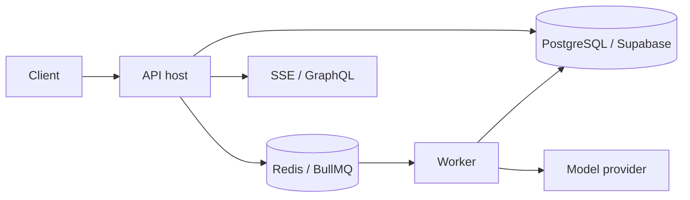

# Run Retinue in production

The embedded facade is intentionally simple. Production deployments use the same engine with durable stores, a queue, an API host, and workers.

| Choose | When |
|---|---|
| **Embedded** | You are learning, writing a script, testing, or can accept in-process state. |
| **Server** | You need multi-process work, persistent state, recovery, realtime clients, or tenant-aware hosting. |

The repository's `compose.yaml` starts PostgreSQL with pgvector, Redis, migrations, the reference app, API host, and worker. See [Configuration](../getting-started/configuration), [Durable runtime](../concepts/durable-runtime), and [Troubleshooting](../troubleshooting).
