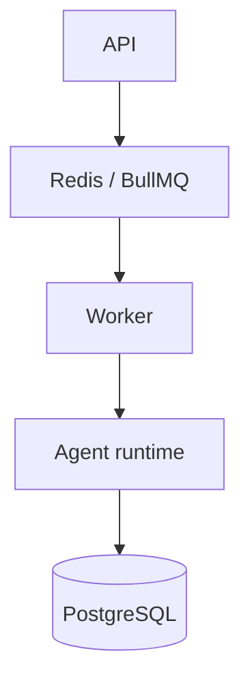

# Redis and BullMQ

PostgreSQL is durable state. Redis/BullMQ is the work queue. Workers receive queued run jobs and persist their results back to PostgreSQL.

Configure `FORGE_REDIS_URL`. Redis being unavailable prevents queue-based work from being dispatched; it is not a substitute for the database. BullMQ provides job delivery while Forge's run claim, checkpoint, and idempotency contracts protect durable execution.

Next: [Workers](workers), [PostgreSQL](postgres), and [durable runtime](../concepts/durable-runtime).
