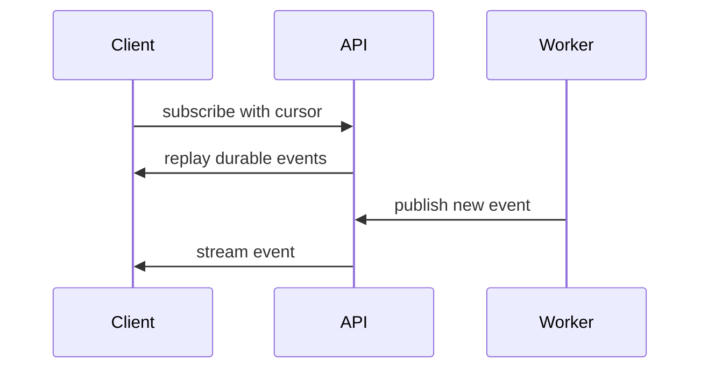

# SSE and streaming

Server-Sent Events stream a run's durable event log to a client. Events carry run and sequence information, so a reconnect can replay from a cursor and then follow live events without duplicating rendered parts.

Use SSE for a lightweight streaming client; GraphQL subscriptions use the same durable event semantics. Configure proxies to avoid buffering event streams and allow long-lived responses.

Next: [GraphQL](graphql), [Frontend](../frontend/overview), and [durable runtime](../concepts/durable-runtime).
