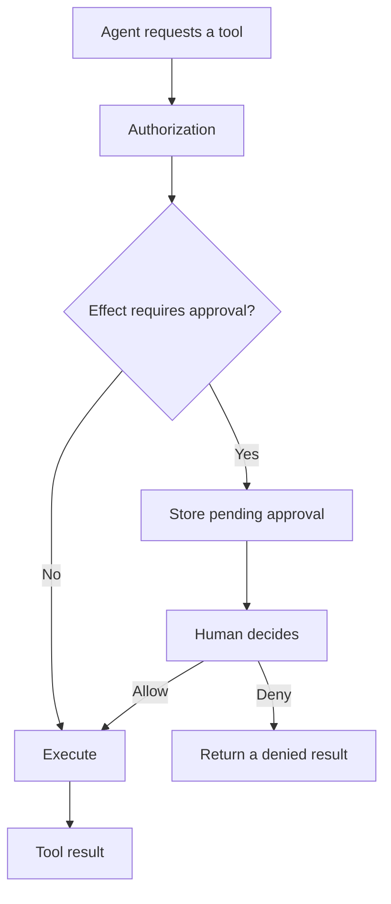

# Safety and control

Retinue keeps control in the application, not in the model prompt. Tools are authorized when they are discovered and again when they are executed. Actions that have an external or destructive effect can pause for a human decision.

Use [Human-in-the-loop](../concepts/human-in-the-loop) for the pause-and-resume model, [Approvals and safety](../guides/approvals-and-safety) for implementation guidance, and [Guardrails](../concepts/guardrails) for model-facing data controls.
